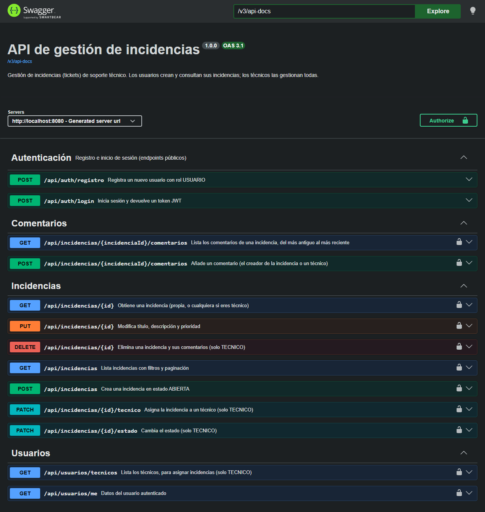

# API de gestión de incidencias

[](https://github.com/hanzlaarif6-ctrl/api-gestion-incidencias/actions/workflows/ci.yml)

API REST para gestionar **incidencias (tickets) de soporte técnico**, al estilo del servicio de soporte de una administración pública. Los empleados abren incidencias y siguen su estado; el equipo técnico las asigna, las comenta y las resuelve.

**Stack:** Java 21 · Spring Boot 3.5 · Spring Data JPA (Hibernate) · PostgreSQL · Flyway · Spring Security + JWT · Bean Validation · springdoc-openapi (Swagger) · JUnit 5 · Mockito · Maven · Docker Compose



## Funcionalidades

- **Registro e inicio de sesión** con contraseñas cifradas con BCrypt y **tokens JWT** (HS256, 60 min por defecto).
- **Dos roles:**
  - `USUARIO`: crea incidencias, **solo ve las suyas**, puede editarlas mientras están `ABIERTA` y comentarlas.
  - `TECNICO`: ve **todas**, cambia su estado, las asigna a un técnico, las comenta y las elimina.
- **CRUD de incidencias** con **estado** (`ABIERTA`, `EN_CURSO`, `RESUELTA`, `CERRADA`) y **prioridad** (`BAJA`, `MEDIA`, `ALTA`, `CRITICA`).
- **Ciclo de vida controlado**: solo se permiten estas transiciones; cualquier otra devuelve `409 Conflict`:

  ```
  ABIERTA  → EN_CURSO | CERRADA
  EN_CURSO → RESUELTA | ABIERTA
  RESUELTA → CERRADA  | EN_CURSO
  CERRADA  → (estado final)
  ```

- **Listado con filtros combinables** (estado, prioridad, técnico asignado y texto libre en título y descripción), **paginación** y **ordenación**.
- **Comentarios** en cada incidencia (no se admiten en las cerradas).
- **Validación** de las peticiones y **gestión global de errores** con códigos HTTP correctos y formato estándar *Problem Details* (RFC 9457).
- **Documentación OpenAPI** interactiva en Swagger UI.
- **Docker Compose**: API + PostgreSQL con un solo comando y datos de ejemplo.

## Arquitectura

Arquitectura en capas, con un paquete por responsabilidad:

```
src/main/java/com/hanzlaarif/incidencias
├── web/            Controladores REST: reciben la petición HTTP, validan (@Valid) y delegan
│   └── dto/        Records de entrada y salida: las entidades JPA nunca salen de la API
├── service/        Lógica de negocio y transacciones (@Transactional): permisos, reglas de estado
├── repository/     Spring Data JPA + Specifications para los filtros dinámicos
├── domain/         Entidades JPA (Usuario, Incidencia, Comentario) y enums
├── security/       Filtro JWT, generación y validación de tokens, respuestas 401/403
├── exception/      Excepciones de negocio y @RestControllerAdvice global
└── config/         Spring Security, OpenAPI y datos de demostración
src/main/resources/db/migration   Migraciones Flyway (esquema versionado)
```

```
Cliente ──HTTP──► JwtAuthenticationFilter ──► Controller ──► Service ──► Repository ──► PostgreSQL
                  (valida el token y carga      (DTO +         (reglas,     (JPA/Hibernate)
                   el usuario y su rol)          @PreAuthorize) permisos)
```

### Modelo de datos

```
usuarios 1 ──── * incidencias (creador_id)
usuarios 1 ──── * incidencias (tecnico_id, opcional)
incidencias 1 ── * comentarios (borrado en cascada)
usuarios 1 ──── * comentarios (autor_id)
```

- El esquema lo crea **Flyway** (`V1__esquema_inicial.sql`) con claves foráneas, restricciones `CHECK` para los enums, email único e índices. Hibernate solo lo **valida** (`ddl-auto: validate`).
- Las relaciones `@ManyToOne` son `LAZY`, y los listados cargan creador y técnico con `@EntityGraph` en una sola consulta para **evitar el problema N+1**.
- `open-in-view` está desactivado: todo el acceso a datos ocurre dentro de las transacciones del servicio.

## Cómo arrancarlo

### Con Docker (recomendado)

Requisitos: Docker Desktop.

```bash
docker compose up --build
```

Arranca PostgreSQL 16 y la API en `http://localhost:8080`. La API espera a que la base de datos esté lista gracias al *healthcheck*.

- Swagger UI: http://localhost:8080/swagger-ui.html
- Estado: http://localhost:8080/actuator/health

Con el perfil `demo` (activo por defecto en `docker-compose.yml`) se cargan datos de ejemplo si la base de datos está vacía:

| Rol | Email | Contraseña |
|---|---|---|
| TECNICO | `tecnico@demo.local` | `Tecnico123!` |
| USUARIO | `ana@demo.local` | `Usuario123!` |
| USUARIO | `pere@demo.local` | `Usuario123!` |

Los valores por defecto (usuario y contraseña de la base de datos, clave JWT) son **solo para desarrollo**. Para cambiarlos, copia `.env.example` como `.env`.

### Sin Docker

Requisitos: JDK 21 y un PostgreSQL con una base de datos `incidencias`.

```bash
# Linux / macOS
export JWT_SECRETO=$(openssl rand -base64 32)
./mvnw spring-boot:run
```

```powershell
# Windows (PowerShell)
$env:JWT_SECRETO = "<clave Base64 de al menos 32 bytes>"
.\mvnw.cmd spring-boot:run
```

Variables de entorno: `DB_URL`, `DB_USUARIO`, `DB_PASSWORD`, `JWT_SECRETO` (obligatoria), `JWT_EXPIRACION_MINUTOS`. Añade `SPRING_PROFILES_ACTIVE=demo` para cargar los datos de ejemplo.

## Endpoints

| Método | Ruta | Acceso | Descripción |
|---|---|---|---|
| POST | `/api/auth/registro` | público | Registra un usuario (rol `USUARIO`) |
| POST | `/api/auth/login` | público | Devuelve un token JWT |
| GET | `/api/usuarios/me` | autenticado | Datos del usuario actual |
| GET | `/api/usuarios/tecnicos` | TECNICO | Lista de técnicos |
| GET | `/api/incidencias` | autenticado | Listado filtrado y paginado (un USUARIO solo ve las suyas) |
| POST | `/api/incidencias` | autenticado | Crea una incidencia (`201` + cabecera `Location`) |
| GET | `/api/incidencias/{id}` | propietario o TECNICO | Detalle |
| PUT | `/api/incidencias/{id}` | propietario (si `ABIERTA`) o TECNICO | Modifica título, descripción y prioridad |
| PATCH | `/api/incidencias/{id}/estado` | TECNICO | Cambia el estado |
| PATCH | `/api/incidencias/{id}/tecnico` | TECNICO | Asigna un técnico |
| DELETE | `/api/incidencias/{id}` | TECNICO | Elimina la incidencia y sus comentarios (`204`) |
| GET | `/api/incidencias/{id}/comentarios` | propietario o TECNICO | Comentarios en orden cronológico |
| POST | `/api/incidencias/{id}/comentarios` | propietario o TECNICO | Añade un comentario (`201`) |

Parámetros del listado: `estado`, `prioridad`, `tecnicoId`, `texto`, `page` (desde 0), `size` (por defecto 20, máximo 100) y `sort` (`id`, `titulo`, `fechaCreacion` o `fechaActualizacion`; por defecto `fechaCreacion,desc`).

### Códigos de respuesta

| Código | Cuándo |
|---|---|
| `200` / `201` / `204` | Operación correcta / recurso creado / eliminado |
| `400` | Validación fallida (con el error de cada campo), JSON mal formado, valor de enum desconocido, campo de ordenación no permitido, asignar a alguien que no es técnico |
| `401` | Sin token, token caducado o manipulado, credenciales incorrectas |
| `403` | Rol insuficiente o incidencia de otro usuario |
| `404` | La incidencia no existe |
| `409` | Email ya registrado, transición de estado no permitida, editar una incidencia que ya no está abierta, comentar una cerrada |

## Ejemplos de peticiones

```bash
# 1. Login (con los datos de demo)
curl -s -X POST http://localhost:8080/api/auth/login \
  -H "Content-Type: application/json" \
  -d '{"email":"ana@demo.local","password":"Usuario123!"}'
# {"token":"eyJhbGciOiJIUzI1NiJ9...","tipo":"Bearer","expiraEnSegundos":3600}

TOKEN="eyJhbGciOiJIUzI1NiJ9..."

# 2. Crear una incidencia
curl -s -X POST http://localhost:8080/api/incidencias \
  -H "Authorization: Bearer $TOKEN" -H "Content-Type: application/json" \
  -d '{"titulo":"Pantalla parpadea","descripcion":"El monitor parpadea cada pocos minutos","prioridad":"BAJA"}'

# 3. Listar mis incidencias de prioridad ALTA, 10 por página, ordenadas por título
curl -s "http://localhost:8080/api/incidencias?prioridad=ALTA&size=10&sort=titulo,asc" \
  -H "Authorization: Bearer $TOKEN"

# 4. (Técnico) pasar una incidencia a EN_CURSO
curl -s -X PATCH http://localhost:8080/api/incidencias/1/estado \
  -H "Authorization: Bearer $TOKEN_TECNICO" -H "Content-Type: application/json" \
  -d '{"estado":"EN_CURSO"}'

# 5. Comentar
curl -s -X POST http://localhost:8080/api/incidencias/1/comentarios \
  -H "Authorization: Bearer $TOKEN" -H "Content-Type: application/json" \
  -d '{"texto":"He reiniciado el equipo y sigue igual."}'
```

Formato de error (`application/problem+json`):

```json
{
  "type": "about:blank",
  "title": "Conflict",
  "status": 409,
  "detail": "No se puede pasar una incidencia de ABIERTA a RESUELTA. Transiciones permitidas desde ABIERTA: [EN_CURSO, CERRADA]",
  "instance": "/api/incidencias/1/estado"
}
```

```json
{
  "type": "about:blank",
  "title": "Bad Request",
  "status": 400,
  "detail": "Los datos enviados no son válidos",
  "instance": "/api/incidencias",
  "errores": { "titulo": "no debe estar vacío" }
}
```

## Tests

```bash
./mvnw test          # Linux / macOS
.\mvnw.cmd test      # Windows
```

**69 tests** (JUnit 5), todos en verde:

| Tipo | Clases | Qué prueban |
|---|---|---|
| Unitarios de dominio | `EstadoIncidenciaTest`, `IncidenciaTest` | Transiciones de estado permitidas y prohibidas, fecha de resolución |
| Unitarios con **Mockito** | `IncidenciaServiceTest`, `AuthServiceTest` | Permisos por rol y propietario, reglas de negocio y registro/login, con los repositorios simulados |
| Unitarios de seguridad | `JwtServiceTest` | Token válido, caducado (con un `Clock` fijo), firmado con otra clave y manipulado |
| Repositorio (`@DataJpaTest`) | `IncidenciaRepositoryTest` | Filtros dinámicos con Specifications, paginación y ordenación contra una base de datos real |
| **Integración** (`@SpringBootTest` + MockMvc) | `AuthIntegrationTest`, `IncidenciaIntegrationTest` | Peticiones HTTP completas con seguridad, validación, JPA y Flyway: códigos 200/201/204/400/401/403/404/409, visibilidad por rol, ciclo de vida completo, comentarios |

Los tests de integración usan **H2 en memoria en modo PostgreSQL** y ejecutan las mismas migraciones Flyway que producción, así que no necesitan Docker. GitHub Actions ejecuta todos los tests en cada *push*.

> En Windows con Git Bash, `./mvnw` puede fallar al descargar Maven porque Git Bash incluye una versión antigua de `wget`. Usa `mvnw.cmd` desde PowerShell o CMD.

## Decisiones técnicas

- **DTOs como `record`** en vez de exponer entidades: el contrato de la API no depende del modelo de base de datos, y nunca se serializa la contraseña ni una relación lazy.
- **Flyway + `ddl-auto: validate`**: el esquema está versionado en SQL revisable (como se haría con Oracle u otra base de datos corporativa) y la aplicación no arranca si las entidades no coinciden con él.
- **JWT sin estado**, con el filtro creado a mano en `SecurityConfig` (no como `@Component`, para que Spring Boot no lo registre dos veces). En cada petición se vuelve a cargar el usuario de la base de datos, de modo que un usuario borrado deja de tener acceso al momento.
- **Autorización en dos niveles**: `@PreAuthorize("hasRole('TECNICO')")` para las operaciones de técnico y comprobación de propietario en el servicio, que es donde se conoce la incidencia.
- **Las reglas de estado viven en el enum** `EstadoIncidencia`: un único sitio, fácil de probar.
- **Specifications** para los filtros: una sola consulta para cualquier combinación de filtros, sin un método de repositorio por combinación.
- **Login con el mismo mensaje** tanto si el email no existe como si la contraseña es incorrecta, para no revelar qué cuentas existen.
- **Spring Boot 3.5** (en lugar de 4.x) por madurez, documentación y compatibilidad directa con JUnit 5.

## Posibles mejoras

- Tests de integración con **Testcontainers** sobre PostgreSQL real.
- *Refresh tokens* y revocación de tokens.
- Gestión de usuarios y técnicos por parte de un rol administrador.
- Historial de cambios de estado (auditoría) y notificaciones por email.
- Perfil para **Oracle** (la capa JPA y las migraciones son SQL estándar).
